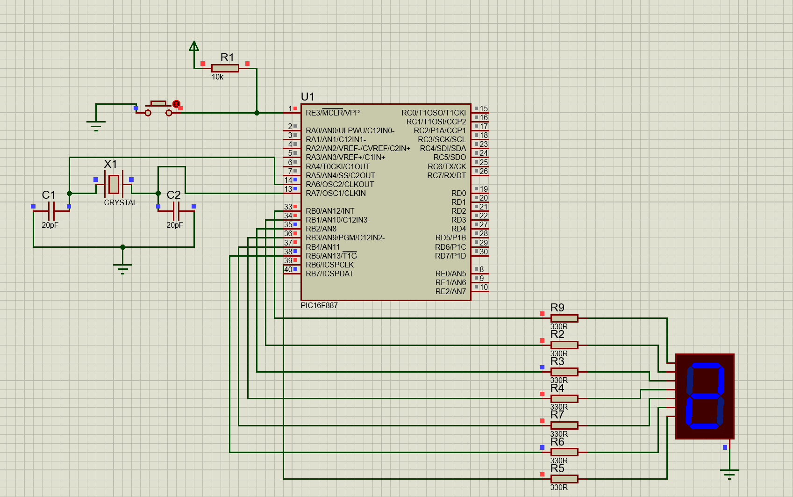

# 7-Segment-Auto-Incrementing-Counter

## Description
This project implements a 7-segment display that auto-increments a counter from 0 to 9 with a delay of 500ms between each increment, using a PIC16F887 microcontroller.

## Circuit
  
*The circuit schematic for the auto-incrementing counter.*

## Files
- `afficheur_7_segment.pdsprj`: Circuit schematic for the 7-segment display.
- `seven_segment.c`: MikroC program for auto-incrementing the counter.

## Instructions
1. Open the `afficheur_7_segment.pdsprj` in Proteus.
2. Load and compile `seven_segment.c` in MikroC to create the hex file.
3. Upload the hex file into the microcontroller in Proteus.
4. Run the simulation to observe the counter incrementing on the 7-segment display.

## Tools
- MikroC Pro for PIC
- Proteus ISIS
